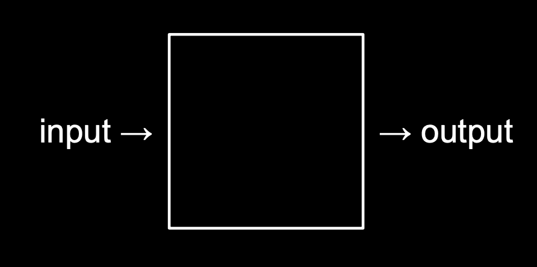
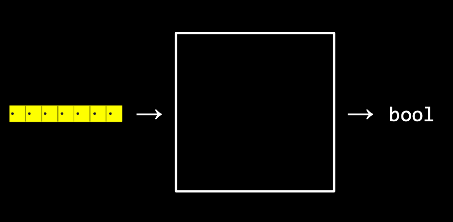
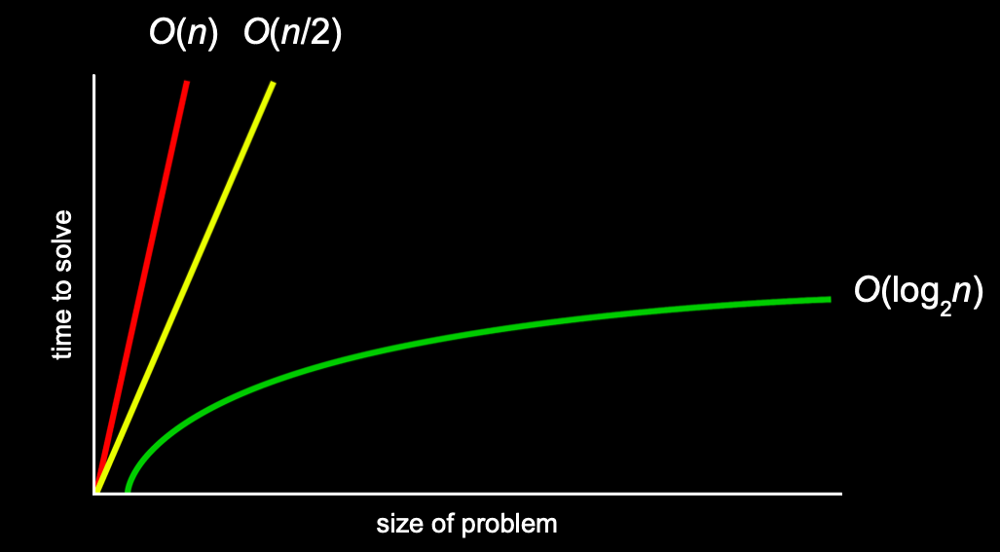
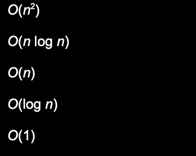

# Notes

For an computer, it is just like a black box. It takes an input, processes it and return an output.



## Searching

It takes an array of certain type of data, search for the target one and return a boolean whether is true(found) or false(not found)



How to tell whether or not the algorithm is efficient?

Then answer is the **running times.**

### Running times Notations

**First Notation is the $O(big-O)$** which is the upper bound of an algorithm(at most)



There are some common numbers in Big-O(which is in decreasing order of running time):

Basically, they are also used in Big-Omega and Big-Theta.



**Second Notation is the $\Omega(Big-Omega)$** which is the lower bound of an algorithm(best case)

**Last Notation is the $\Theta(Big-Theta)$** when the lower bound is equal to the upper bound.

### Linear Search

which is best for unsorted array. It searches for the target one by one.

```pseudocode
pseudocode : 
For i from 0 to n-1
    If number behind doors[i]
        Return true
Return false
```

Running times for it should be : worst case is O(n) and best case is $\Omega(1)$ 

### Binary Search

which is best for sorted array. It starts from the half of the array.

```pseudocode
pseudocode : 
If no doors
    Return false
If number behind doors[middle]
    Return true
Else if number < doors[middle]
    Search doors[0] through doors[middle - 1]
Else if number > doors[middle]
    Search doors[middle + 1] through doors[n - 1]
```

Running times for it should be：worse case is $O(logn)$ and best case is $\Omega(1)$

## Sorting

Turn unsorted array to sorted array.


### Selection Sort

Find the smallest number in array, place it at the first position and loop.

```pseudocode
Pseudocode
For i from 0 to n-1
    Find smallest number between numbers[i] and numbers[n-1]
    Swap smallest number with numbers[i]
```

Running times for it:

- worse case: n + n-1 + n-2 +...+ 1 = $\frac{n^2}{2}+\frac{n}{2} = O(n^2)$
- best case: $\Omega(n^2)$, cause whether or not, it will go through the array once and once more.
- So we better use $\Theta(n^2) $ to describe the running time of it.

### Bubble Sort

Swap when the compared numbers are not in the correct position.

```pseudocode
Pseudocode
Repeat n-1 times
    For i from 0 to n-2
        If numbers[i] and numbers[i+1] out of order
            Swap them
    If no swaps
        Quit
```

Running times for it:

- worse case: $(n-1)^2 = n^2-2n=1 = O(n^2)$
- best case: $\Omega(n)$

### Recursion

A function which it calls itself

### Merge Sort

Sort left half of the numbers, sort right half of the numbers then merge sorted numbers

```pseudocode
pseudocode
If only one number
    Quit
Else
    Sort left half of numbers
    Sort right half of numbers
    Merge sorted halves
```

Running times for it:

- worse case:  O(nlogn)
- best case: $\Omega(nlogn)$
- So we better use $\Theta(nlogn)$  

### Difference among three sorts

Bubble sort is the best in ordered sequences, worst in reverse sequences.

Merge sort is fast on average.

Selection sort is slow on average.
