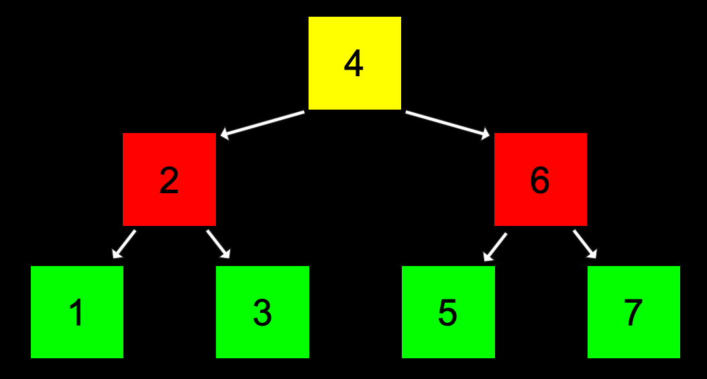

# Notes-Data Structure

Each type of data can be fitted into one data structure.

## Outline

## 1.Array
<div align="center">

</div>
If you want to insert a '4' here, you need to copy the old array to an new memory and add '4', cause there maybe no place for 4 to be inserted after '3'. We **lost run time** here.

<div align="center">

</div>
For the worst case:

- Insert, $O(n)$
- Search, We could use binary search here, so it should be $O(logn)$

For the best case:

- Insert, $\Omega(1)$
- Search, $\Omega(1)$

## 2.Linked List
<div align="center">

</div>
It is a data structure which contains both a value and a pointer which points to the next number.

It needs more space than the array.

```c
typedef struct node
{
    int number;
    struct node *next;
}
node;
```

Time complexity for the Linked List:

Worst case:

- Insert which depends on the situation
  - **if the list is in ordered**, it should cost $O(n)$
  - **if just add to the front of the list**, it should cost $O(1)$
- Search : $O(n)$

Best case:

- Insert : $\Omega(1)$
- Search : $\Omega (1)$

## 3.Trees(Binary Search Trees)
<div align="center">

</div>
<div align="center">

</div>
We learnt the binary search before, which is quite similar.

```c
typedef struct node
{
    int number;
    struct node *left;
    struct node *right;
}
node;
```

```c
//we use the recursion here.
bool search(node *tree, int number)
{
    if (tree == NULL)
    {
        return false;
    }
    else if (number < tree->number)
    {
        return search(tree->left, number);
    }
    else if (number > tree->number)
    {
        return search(tree->right, number);
    }
    else if (number == tree->number)
    {
        return true;
    }
}
```

For worst case:

- Search : $O(logn)$
- Insert : $O(logn)$

For best case:

- Search: $\Omega(1)$
- Insert: $\Omega (1)$

## 4.Hash Tables

It is a data structure which contains **keys with values.**
<div align="center">

</div>

It takes an input and trough a hash function then outputs the result
<div align="center">

</div>
<div align="center">

</div>
```c
typedef struct node
{
    char word[LONGEST_WORD + 1];
    struct node *next;
}
node;
```

More memory cost from left to right.

Worst case:

- Search : $O(n)$
- Insert :  $O (n)$ or $O(1)$

Best case:

- Search : $\Omega (1)$
- Insert : $\Omega (1)$

## 5.Tries
<div align="center">

</div>
```c
typedef struct node
{
    bool is_word;
    struct node *children[SIZE_OF_ALPHABET];
}
node;
```

For the worst case:

- Insert, Search : $O(1)$

## 6.Abstract Data Structure

Queues and Stacks

Queues are FIFO.

Stacks are FILO.
